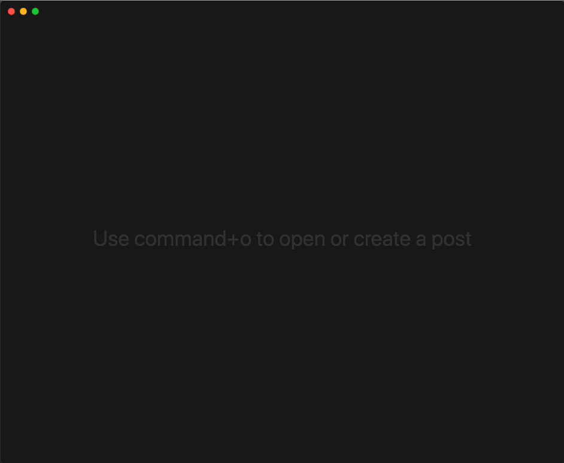
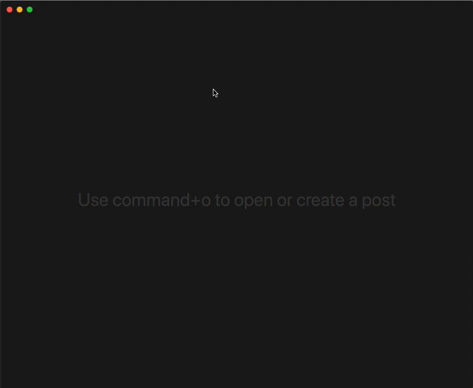

# Grit

> A Markdown editor for staticly generated blogs.

This app alows you to manage a directory full of Markdown blog posts more easily. 
You can edit, create and delete Markdown files as well as trigger a deployment via Git.

## Get Grit

⚠️ Use it at your own peril, this is an **alpha version**. There be 🐉s. 

[Download the latest release](https://github.com/kahlil/grit/releases/download/v1.0.0-alpha.2/Grit-darwin-x64-1.0.0-alpha.2.zip) (macOS only).

## Features

⬇️ **Store** the path to your folder containing your Markdown files & 👓 **Filter** through your Markdown files.

✏️ **Edit** any file in that folder

✨ **Create** a new Markdown file for a new post

🚢 **Deploy** your new post via Git with `cmd+u`

# License

MIT
